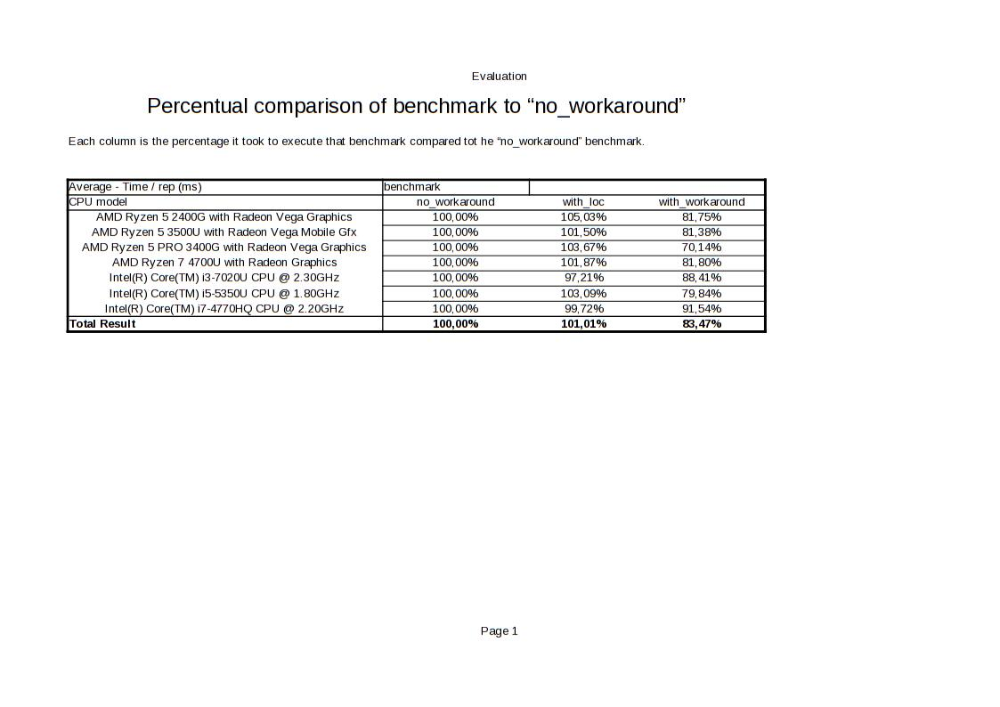

A simple benchmark for `pandas.DataFrame` being used in freqtrade.

We need to know whether `PerformanceWarning` is an indication of a significant slowdown
 or whether it can be safely ignored.
Therefore we are collecting stats to make a decision.

[Related issue on freqtrade](https://github.com/freqtrade/freqtrade/issues/5408)

# How to run

You will need [`docker`](https://docs.docker.com/get-docker/) and [`docker-compose`](https://docs.docker.com/compose/)

`docker-compose up`

**Help**

`docker-compose run --rm bench --help` will output the help of the script.

**Specific benchmark**

You can run a specific benchmark with `docker-compose run --rm bench -b <benchmark_name> -c /app/results.csv`,
which will run it and append the result to `results.csv`.

## Sharing results

Create a pull request with the updated CSV containing your values.

# How to evaluate

 - Open [`eval.fods`](./eval.fods) (works with LibreOffice)
 - Copy paste the contents of `results.csv` onto the `results.csv` sheet (**don't replace the red text**)
 - Switch to the second sheet (Called "Evaluation"), right click on the table and select "Refresh..."

You might need to extend the second table beside the first (pivot table) one if your CPU is hitherto unknown. 

## Current results

Generated with LibreOffice [`gen_img.sh`](./gen_img.sh)

